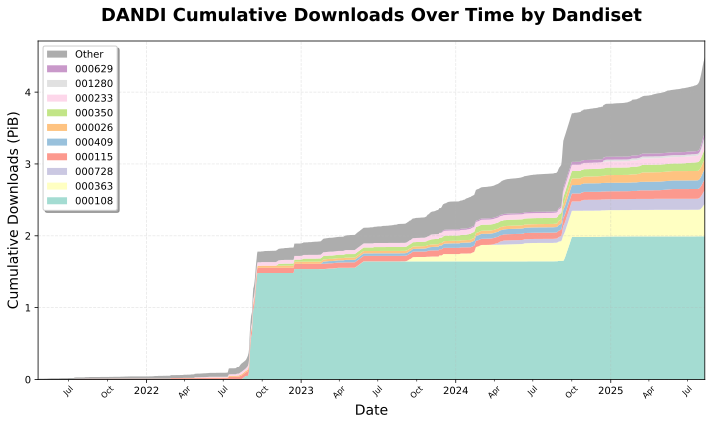

# DANDI Access Visualization Tools

This repository contains tools for creating geographic visualizations of DANDI data access patterns, including choropleth maps and scatter plots showing data download patterns by country and region.

The source data that is being visualized is here: https://github.com/dandi/access-summaries. By default, the access-summaries repo is expected to be downloaded next to this repo, though this can be adjusted using optional CLI args.

## Features

- **Choropleth Maps**: Country-level data visualization with color-coded regions
- **Scatter Maps**: Region-level visualization with proportional point sizes
- **Multiple Dandiset Support**: Process specific dandisets or combinations of dandisets
- **Flexible Data Paths**: Configure custom data directory locations
- **Centralized Styling**: Consistent color schemes across all visualizations
- **Publication Quality**: High-resolution SVG and PDF outputs
- **Flexible Scaling**: Linear and logarithmic scale options

## Installation

Navigate to the visualization directory and install dependencies:

```bash
cd visualization
pip install -r requirements.txt
```

### Dependencies
- **pandas**: Data manipulation
- **matplotlib**: Plotting framework
- **numpy**: Numerical operations
- **cartopy**: Geographic projections and mapping
- **pyyaml**: YAML configuration file parsing

## Usage

### Basic Usage

#### All Dandisets (Default)
```bash
# Process all available dandisets
python create_choropleth.py --log-scale
```

**Creates:** Global country-level visualization showing 7.69 PB across 117 countries


*Global DANDI downloads by country (logarithmic scale) - showing Netherlands and US as top consumers*

#### Single Dandiset
```bash
# Process specific dandiset with automatic filename
python create_choropleth.py --dandiset 000026 --log-scale
```

**Creates:** Focused view of single dandiset (114.23 TB across 44 countries)


*Dandiset 000026 downloads by country - US and Netherlands dominate usage*

#### Multiple Dandisets
```bash
# Process multiple specific dandisets
python create_scatter_map.py --dandiset 000026,000409,000488
```

**Creates:** Regional scatter plot showing precise geographic distribution


*Combined regional view of 3 dandisets - points show both location and download volume with color/size coding*

#### All Dandisets (Regional View)
```bash
# Process all available dandisets as scatter plot
python create_scatter_map.py
```

**Creates:** Comprehensive regional scatter plot showing global access patterns (655 regions across 470 dandisets)


*Global DANDI regional access patterns - comprehensive view of all dandisets showing worldwide download distribution*

#### Temporal Analysis
```bash
# Show downloads over time with top dandisets
python create_temporal_chart.py
```

**Creates:** Cumulative stacked area chart showing growth of DANDI downloads (4.49 PB across 469 dandisets, 2021-2025)



*DANDI cumulative downloads over time - stacked visualization showing growth of top 10 dandisets individually with others grouped as "Other"*

### Command Reference

#### Choropleth Maps (Country-level)

```bash
python create_choropleth.py [options]

Options:
  --log-scale, -l          Use logarithmic scale (recommended for wide ranges)
  --output, -o FILE        Output filename (default: output/choropleth_map.svg)
  --data-path, -d PATH     Data directory (default: ../access-summaries/content)
  --dandiset DANDISETS     Comma-separated dandiset IDs (default: all)
  --help                   Show help message
```

#### Scatter Maps (Region-level)

```bash
python create_scatter_map.py [options]

Options:
  --output, -o FILE        Output filename (default: output/scatter_map.svg)
  --data-path, -d PATH     Data directory (default: ../access-summaries/content)
  --dandiset DANDISETS     Comma-separated dandiset IDs (default: all)
  --help                   Show help message
```

#### Temporal Charts (Time-series)

```bash
python create_temporal_chart.py [options]

Options:
  --output, -o FILE        Output filename (default: output/temporal_chart.svg)
  --data-path, -d PATH     Data directory (default: ../access-summaries/content)
  --dandiset DANDISETS     Comma-separated dandiset IDs (default: all)
  --top-n, -n NUMBER       Number of top dandisets to show individually (default: 10)
  --help                   Show help message
```

## Output Files

Both scripts generate:
- **SVG files**: Vector format for publications (300 DPI equivalent)
- **PDF files**: Alternative format for presentations
- **Console output**: Summary statistics and processing information
